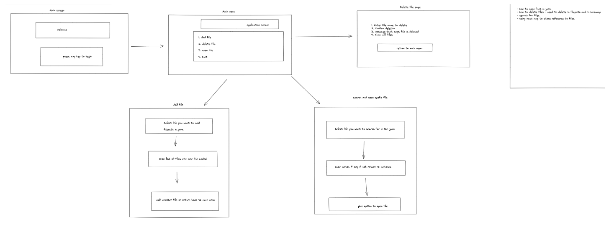

# File Creation Assessment
### Task
As directed by Company Lockers Pvt. Ltd. I have created a prototype which  You’re asked to develop a prototype of the application. The prototype of the application will be then presented to the relevant stakeholders for the budget approval.

## Installation & usage
### Installation
- Clone or download the repo.
- Cd into project1 folder.
- In your command line, run `javac project1.java`.
- Then run `java project1`

### Usage
- Follow the instructions on the command line 
- 1 for creation, 2 for deletion, 3 for seacrhing and 0 to exit the application

## Technologies
- Java
- HashMaps for storing refernces to files
- File
- Path to

## Process

- Mapped out a skeleton using Excildraw as seen above
- Wrote pseudo code to break down the logic of collecting user input, accessing file paths, linking the two and assigning functionality to the CLI.

## Challenges
- Find the relative filepath on my virtual machine did produce some issues

## Future features
- This project would also provide functionality to edit files
- When file creation happens the user could choose the type of file they want to create rather than being locked into txt files.

